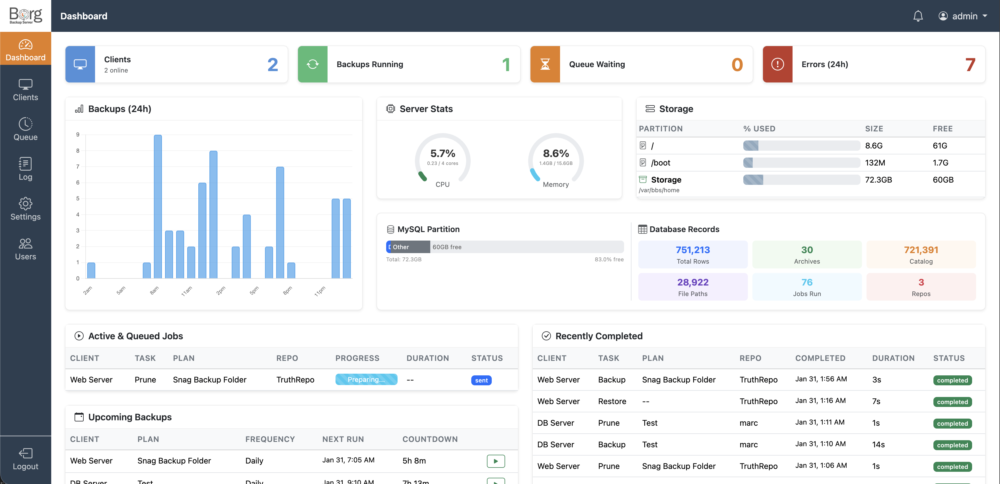

# Borg Backup Server

> **Early Beta (v0.8)** — This software is under active development and likely contains bugs. It is not recommended for production workloads. Use at your own risk.

A self-hosted web application for centrally managing [BorgBackup](https://borgbackup.readthedocs.io/) across multiple Linux and macOS endpoints. A lightweight agent polls the server for tasks over HTTPS, backs up over SSH to the server, and reports progress back. No inbound connections to endpoints required — works behind firewalls and NAT. Includes a setup wizard for zero-config installation.

---

## Features

- **Agent-based architecture** — endpoints initiate all connections; no inbound ports needed on clients
- **SSH with append-only security** — agents back up over SSH but cannot delete existing archives
- **Setup wizard** — browser-based installer configures database, admin account, and storage in minutes
- **Real-time progress** — live progress bars during backups
- **File-level restore** — browse archive contents in a collapsible tree, restore individual files or entire directories
- **Download archives** — extract and download files as .tar.gz directly from the browser
- **Flexible scheduling** — 10min to monthly intervals, multiple times per day, manual trigger
- **Backup templates** — pre-configured directory sets for common server roles (web, database, mail, etc.)
- **Retention policies** — per-plan prune settings (hourly/daily/weekly/monthly/yearly)
- **Multi-user** — role-based access (admin sees all, users see own clients)
- **Queue management** — concurrent job limits, cancel/retry, priority ordering
- **Encrypted passphrases** — repository passwords encrypted at rest (AES-256-GCM)
- **Email alerts** — SMTP notifications on backup failure
- **Dashboard** — backup charts, server stats, active jobs, log feed with 15s auto-refresh

## Screenshots



---

## Quick Start

### Server

```bash
git clone https://github.com/marcpope/borgbackupserver.git
cd borgbackupserver
composer install

# Install the SSH helper for agent backups
sudo cp bin/bbs-ssh-helper /usr/local/bin/bbs-ssh-helper
sudo chmod 755 /usr/local/bin/bbs-ssh-helper
sudo bash -c 'echo "www-data ALL=(root) NOPASSWD: /usr/local/bin/bbs-ssh-helper" > /etc/sudoers.d/bbs-ssh-helper'
```

Configure your web server (Apache or Nginx) to point at the `public/` directory, then open the site in your browser. The **setup wizard** will walk you through database, admin account, and storage configuration.

See [docs/INSTALL.md](docs/INSTALL.md) for full server setup (packages, web server, SSL, cron, wizard walkthrough).

### Agent

From the BBS web UI, create a client, then run the install command on your endpoint:

```bash
curl -s "https://your-server/api/agent/download?file=install.sh" | sudo bash -s -- \
    --server https://your-server --key YOUR_API_KEY
```

See [docs/AGENT.md](docs/AGENT.md) for manual install and configuration.

---

## Documentation

| Document | Description |
|---|---|
| [Installation Guide](docs/INSTALL.md) | Server setup, database, web server, cron |
| [Agent Deployment](docs/AGENT.md) | Agent install, config, service management |
| [User Guide](docs/USER_GUIDE.md) | Using the web UI, creating plans, restoring files |
| [API Reference](docs/API.md) | Agent API endpoints with request/response examples |
| [Contributing](docs/CONTRIBUTING.md) | Development setup, conventions, how to help |

---

## Tech Stack

| Layer | Technology |
|---|---|
| Backend | PHP 8.1+ (no framework) |
| Routing | AltoRouter |
| Database | MySQL / MariaDB |
| Frontend | Bootstrap 5, Chart.js |
| Agent | Python 3 (stdlib only) |
| Backup engine | BorgBackup |

---

## Architecture

```
Endpoint                                 BBS Server
  [bbs-agent.py]                         [PHP + MySQL + borg]
       |                                      |
       |--- register (hostname, OS) --------> |  HTTPS
       |--- download SSH key ---------------> |  HTTPS
       |                                      |
       |--- poll for tasks -----------------> |  HTTPS
       |<-- backup command + passphrase ----- |
       |                                      |
       |  [borg create over SSH] -----------> |  SSH (borg serve --append-only)
       |                                      |
       |--- progress (files, bytes) --------> |  HTTPS (every 5s)
       |--- status (completed/failed) ------> |  HTTPS
       |--- file catalog (batch) -----------> |  HTTPS
       |                                      |
       |            [server runs borg prune]  |  local (server-side)
       |                                      |
       |--- poll for tasks -----------------> |  (next cycle)
```

- **HTTPS** for control plane (task polling, progress, status)
- **SSH** for data plane (borg backup/restore via `borg serve`)
- **Append-only** — agents cannot delete existing archives; pruning runs server-side

---

## License

[MIT License](LICENSE) with Beer-Ware Addendum.

If this software saved your backups (or your job), consider buying the maintainer a beer.
